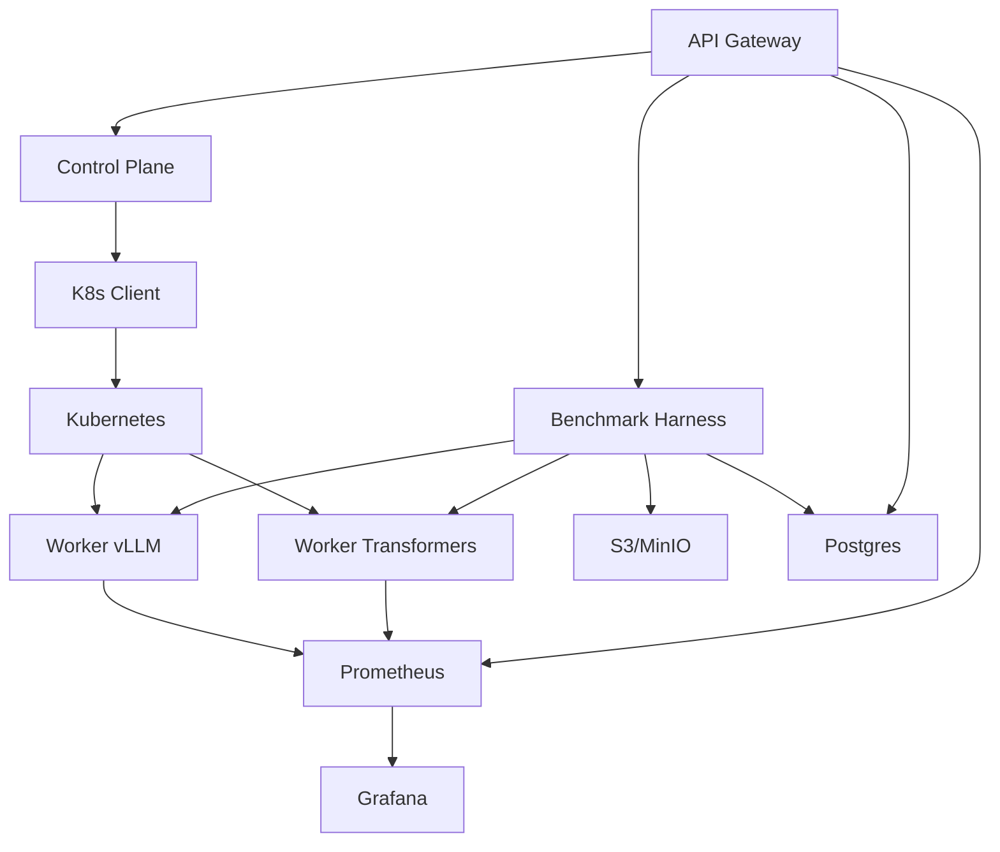

# TokenForge: LLM Inference & Benchmark Platform

TokenForge is a platform for deploying, serving, and benchmarking Large Language Models (LLMs) across different runtime engines.

## Features

- **Pluggable Runtime Engines**: Support for vLLM and Hugging Face Transformers (extensible to other runtimes)
- **Model Deployment**: Deploy models on Kubernetes with configurable resources
- **Inference API**: Unified API for text generation across different runtimes
- **Benchmark Harness**: Run reproducible benchmarks with configurable workloads
- **Metrics Collection**: Prometheus/Grafana dashboards for latency, throughput, VRAM usage, and more
- **Artifact Storage**: Store benchmark results and reports in S3-compatible storage

## System Architecture



For a more detailed architecture diagram, see [Architecture Documentation](docs/architecture.md)

- **API Gateway**: Go HTTP server with endpoints for deployment, inference, and benchmarking
- **Control Plane**: Go service for managing model deployments on Kubernetes
- **Workers**: Python FastAPI servers that expose a normalized interface to LLM engines
- **Benchmark Harness**: Python tool for running load tests and generating reports
- **Observability**: Prometheus for metrics collection and Grafana for visualization
- **Persistence**: PostgreSQL for run metadata and S3/MinIO for artifacts

## Getting Started

### Prerequisites

- Docker and Docker Compose
- Kubernetes cluster (for production deployment)
- Go 1.19+
- Python 3.9+

### Local Development

1. Clone the repository:

```bash
git clone https://github.com/tokenforge/llm-infra-bench.git
cd llm-infra-bench
```

2. Start the development environment:

```bash
make dev
```

This will start PostgreSQL, MinIO, Prometheus, Grafana, and a stub worker for local development.

3. Run the API server:

```bash
make run-api
```

### Running Benchmarks

1. Configure your benchmark in `configs/benchmark.yaml`:

```yaml
model: meta-llama/Llama-3-8b-instruct
runtimes: [vllm, transformers]
workloads:
  - name: qa-short
    qps: 5
    duration_s: 180
    prompt_len: 256
    gen_tokens: 128
```

2. Run the benchmark:

```bash
make bench
```

3. View the results in Grafana (http://localhost:3000) or check the generated HTML report.

### Deploying to Kubernetes

1. Configure your Kubernetes cluster:

```bash
kubectl create namespace tokenforge
```

2. Deploy the infrastructure:

```bash
make deploy-k8s
```

## API Reference

### Deployment

```
POST /deploy
{
  "model": "meta-llama/Llama-3-8b-instruct",
  "runtime": "vllm",
  "quant": "fp16"
}
```

### Inference

```
POST /infer
{
  "model": "meta-llama/Llama-3-8b-instruct",
  "runtime": "vllm",
  "prompt": "Explain KV cache",
  "max_tokens": 128,
  "temperature": 0.2,
  "top_p": 0.95,
  "stream": false
}
```

### Benchmarking

```
POST /benchmarks/run
{
  "model": "meta-llama/Llama-3-8b-instruct",
  "runtimes": ["vllm", "transformers"],
  "workloads": [
    {
      "name": "qa-short",
      "qps": 5,
      "duration_s": 180,
      "prompt_len": 256,
      "gen_tokens": 128
    }
  ]
}
```
