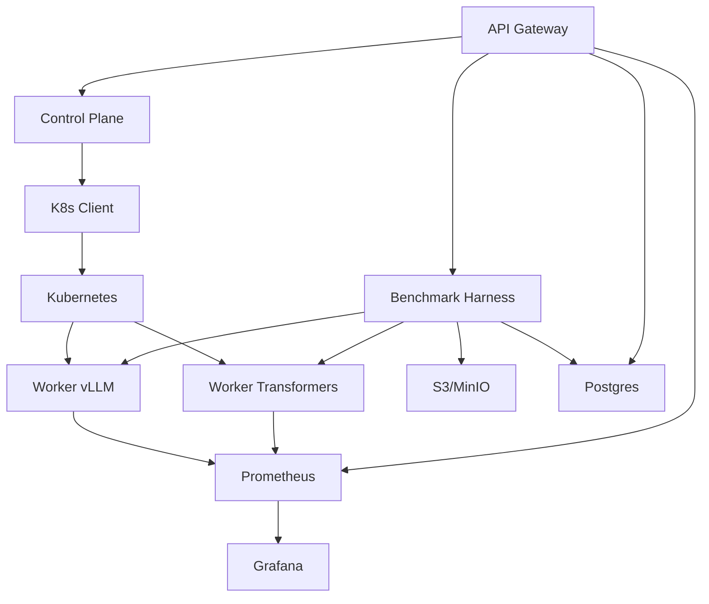

# TokenForge Architecture

## System Architecture Diagram

## Component Descriptions

- **API Gateway**: Go HTTP server with endpoints for deployment, inference, and benchmarking
- **Control Plane**: Registry and Kubernetes client for managing model deployments
- **K8s Client**: Manages Kubernetes resources (Deployments, Services)
- **Workers**: Python FastAPI servers for vLLM and Transformers runtimes
- **Benchmark Harness**: Python tool for running load tests and generating reports
- **S3/MinIO**: Storage for benchmark artifacts
- **Postgres**: Database for run metadata
- **Prometheus**: Metrics collection
- **Grafana**: Metrics visualization
